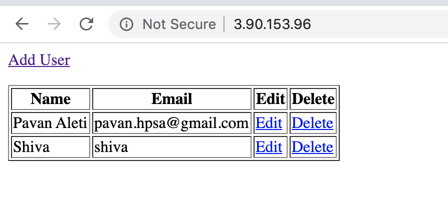

# flask-crud-app
This Repo contains simple flask CRUD operations with mysql

## Dependencies


You should have mysql installed on the localhost in order to test this app ( you can also have it installed on remote and should be updated db_config.py)

Also you should install `flask, flask_table and flask-mysql` use command

    `sudo pip3 install flask flask_table flask-mysql`


# If you are running on the local system

`Dependencies should be installed`

1. `git clone https://github.com/aleti-pavan/flask-crud-app.git`

2. `cd flask-crud-app\`

3. Create `appdb` and `user_table` for the app. You can either create it manually or choose to use created sql file with following command.

     `mysql -uroot < database/user.sql`


4. If you are using Mac/Linux use `export FLASK_APP=main.py` , if you are using windows `set FLASK_APP=main.py`

5. execute `flask run`

6. curl http://localhost:5000 or you can locate the url into the browser. You should now be able to perform CREATE, READ, UPDATE AND DELETE (CRUD) on the app.


# If you are running on server with remote database like rds use following commands (Tested on ubuntu 18.04)


`Dependencies should be installed`

```   

      sudo su
      apt-get update
      apt install git python3-pip mysql-client-core-5.7 -y
      sudo pip3 install flask flask_table flask-mysql
      
```

1. `git clone https://github.com/aleti-pavan/flask-crud-app.git`

2. `cd flask-crud-app\`

3. Create `appdb` and `user_table` for the app. You can either create it manually or choose to use created sql file with following command

    `mysql -h <rds_accesspoint> -P 3306 -u<username> -p < database/user.sql`

4. Update the `db_config.py` with necessary values `username, host, password` to have the app connected to remote DB.

5. At the very end of the `main.py` file `comment app.run() and uncomment app.run(host="0.0.0.0", port=80)`

6. execute `python3 main.py`

7. Put the insance ip on to the browser.


# App looks similar to below image



